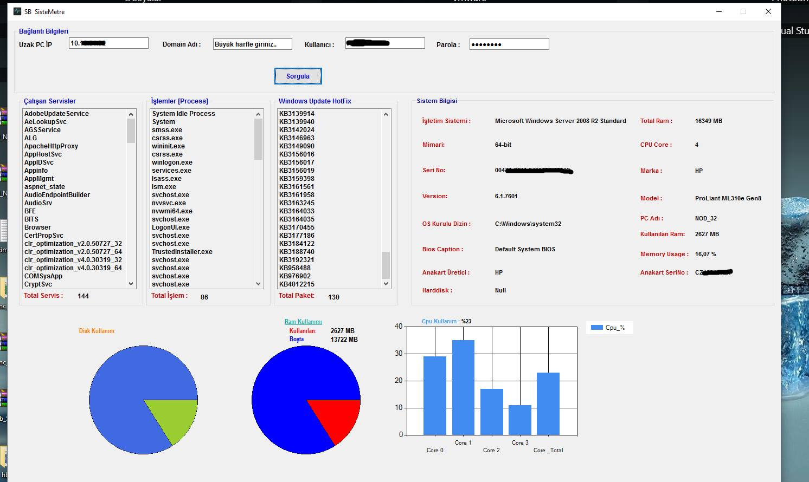

# SisteMetre 

  

# Gettin Started 
- Sistemere is a WMI application that monitors information of remote computer/server 
- It collects running services, processes, windows hotfix list , cpu, ram usage, hardware info etc.  

# Prerequisites
- You need to install at least .Net Framework 4. 0

# Installing

- Download <a href="https://github.com/farcompen/SisteMetre/blob/master/Sistemetre_Setup.rar"> setup file </a>, then click .exe or .msi file  

- After installing program ,enter ip adress of remote pc ,domain (not required) , username and password then click "sorgula" button 

# Authors 

<a href="https://github.com/farcompen"> Faruk GÜNGÖR </a>

# License
This project is licensed under the GPL3.0  License - see the <a href="https://github.com/farcompen/SisteMetre/blob/master/LICENSE">LICENSE file </a> for details

